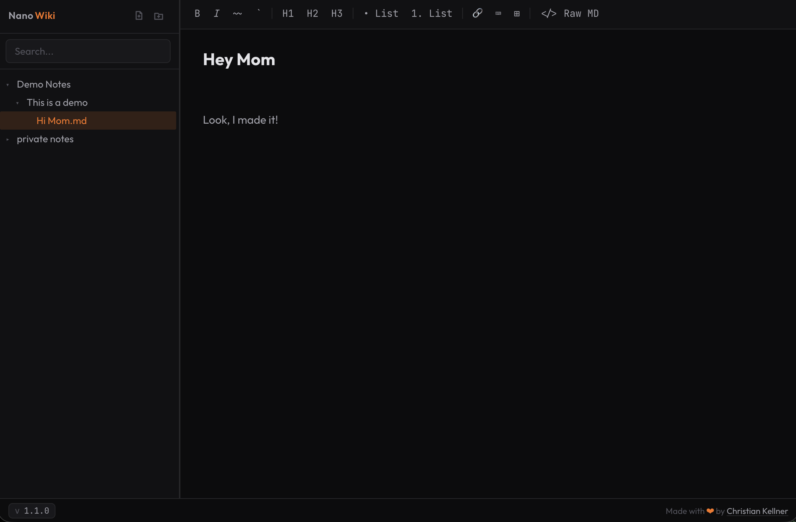

# NanoWiki

<p align="center">

<a href="https://orange-coding.net/">
<picture>
  
</picture>
</a>
</p>

A minimalist local wiki. No login, no cloud. Reads and writes Markdown files directly from a local directory. Fulltext Search included ✊

<p align="center">
  
  
  
</p>

---

## Features

- **File tree** - browse, create, rename, delete `.md` files and folders
- **WYSIWYG editor** - TipTap with Bold, Italic, Strikethrough, Inline Code, H1–H3, Lists, Links, Code Blocks, Tables
- **Raw Markdown mode** - toggle `</> Raw MD` to edit in CodeMirror 6 with syntax highlighting
- **Auto-save** - debounced 500ms, dirty indicator (`●`) in the browser tab title
- **Full-text search** - SQLite FTS5, incremental index updates via chokidar
- **Image drag & drop** - drop images onto the editor, saved next to the `.md` file
- **External change detection** - toast notification when a file is changed outside the app
- **Resizable sidebar** - drag handle, width persisted in `localStorage`

---

## Screenshots



---

## Prerequisites

- **Node.js 22+**

---

## Running nanowiki

### Method 1 - "Bare metal"

```bash
yarn run start
```

### Method 2 - Docker Compose (recommended)

Configuration is driven by your `.env` file, the same one used for local development. Docker Compose reads it automatically.

```bash
cp .env.example .env
# edit .env to set NANOWIKI_DATA_DIR and PORT, then:
docker compose up -d
```

The relevant `.env` variables:

```
NANOWIKI_DATA_DIR=/path/to/your/wiki   # host directory mounted into the container
PORT=3000                               # port exposed on your host
```

Both have sensible defaults (`./data` and `3000`) so the compose file works out of the box without a `.env`.

### Method 3 - Plain Docker

```bash
docker run -d \
  --name nanowiki \
  --restart unless-stopped \
  -p 3000:3000 \
  -v /path/to/your/wiki:/data \
  ghcr.io/orangecoding/nanowiki:latest
```

Replace `/path/to/your/wiki` with the directory on your machine that contains (or will contain) your `.md` files. That's the only required parameter.

---

## Local Development Setup

**1. Install dependencies**

```bash
yarn install              # root tooling (linter, prettier, husky)
yarn --cwd backend install
yarn --cwd frontend install
```

**2. Configure the data directory**

```bash
cp .env.example .env
```

Edit `.env`:

```
NANOWIKI_DATA_DIR=/path/to/your/wiki
PORT=3001
```

`NANOWIKI_DATA_DIR` must point to an existing directory.

---

## Scripts

| Command             | Description                                                                      |
| ------------------- | -------------------------------------------------------------------------------- |
| `yarn dev`          | Start Vite dev server (frontend only, HMR at `http://localhost:5173`)            |
| `yarn start`        | Build frontend, then start backend serving everything at `http://localhost:3001` |
| `yarn test`         | Run all tests (backend + frontend)                                               |
| `yarn lint`         | ESLint                                                                           |
| `yarn format`       | Prettier (write)                                                                 |
| `yarn format:check` | Prettier (check only, used in CI)                                                |

> **Dev mode:** `yarn dev` starts only the Vite frontend dev server. The backend must be started separately:
>
> ```bash
> node --env-file=.env backend/src/server.js
> ```

---

## Tests

```bash
yarn test            # backend + frontend
yarn test:backend    # backend only
yarn test:frontend   # frontend only
```

Test files live in `backend/test/` and `frontend/test/`.

---

## License

Apache 2.0 - see [LICENSE](LICENSE).
