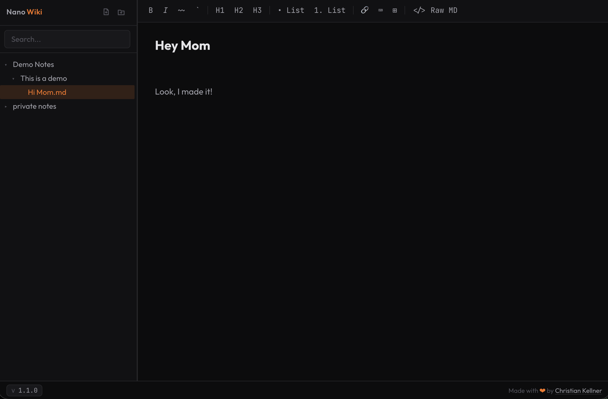

# NanoWiki

<p align="center">
<a href="https://orange-coding.net/">
<picture>
  
</picture>
</a>
</p>

A local wiki that reads and writes Markdown files from a directory on your machine. No login, no cloud, no database to manage.

<p align="center">
  
  
  
</p>

---



---

## Features

- **WYSIWYG editor** with toolbar (Bold, Italic, Strikethrough, Code, H1-H3, Lists, Links, Code Blocks, Tables)
- **Raw Markdown mode** via CodeMirror 6 with syntax highlighting
- **File tree** - browse, create, rename, and delete `.md` files and folders
- **Full-text search** - SQLite FTS5, updated incrementally as files change
- **Image drag & drop** - images are saved next to the `.md` file
- **AI rewrite** - rephrase or improve selected text using an LLM of your choice
- **Auto-save** - debounced 500ms, dirty indicator in the tab title
- **External change detection** - notifies you when a file is modified outside the app

---

## Running NanoWiki

### Docker Compose (recommended)

```bash
cp .env.example .env
# set NANOWIKI_DATA_DIR and PORT in .env, then:
docker compose up -d
```

Defaults are `./data` and port `3000`, so it works out of the box without touching `.env`.

### Plain Docker

```bash
docker run -d \
  --name nanowiki \
  --restart unless-stopped \
  -p 3000:3000 \
  -v /path/to/your/wiki:/data \
  ghcr.io/orangecoding/nanowiki:latest
```

### Bare metal

Requires Node.js 22+.

```bash
yarn run start
```

---

## AI Rewrite

Select any text in the editor and click the AI rewrite button to rephrase or improve it. The feature requires an LLM provider configured in `.env`. Three options are supported:

**OpenAI**

```
OPENAI_API_KEY=sk-...
OPENAI_MODEL=gpt-4o-mini
```

**Anthropic / Claude**

```
ANTHROPIC_API_KEY=sk-ant-...
ANTHROPIC_MODEL=claude-sonnet-4-6
```

**Ollama (local, no API key needed)**

```
OLLAMA_BASE_URL=http://localhost:11434
OLLAMA_MODEL=llama3
```

Configure exactly one block. If none are set, the rewrite button is hidden.

---

## Local Development

**1. Install dependencies**

```bash
yarn install
yarn --cwd backend install
yarn --cwd frontend install
```

**2. Configure**

```bash
cp .env.example .env
# edit NANOWIKI_DATA_DIR and PORT
```

**3. Start**

```bash
# terminal 1 - backend
node --env-file=.env backend/src/server.js

# terminal 2 - frontend (HMR at http://localhost:5173)
yarn dev
```

Or build and serve everything together:

```bash
yarn start   # http://localhost:3001
```

---

## Scripts

| Command              | What it does                                     |
| -------------------- | ------------------------------------------------ |
| `yarn dev`           | Vite dev server (frontend only, HMR)             |
| `yarn start`         | Build frontend, start backend serving everything |
| `yarn test`          | Run all tests (backend + frontend)               |
| `yarn test:backend`  | Backend tests only                               |
| `yarn test:frontend` | Frontend tests only                              |
| `yarn lint`          | ESLint                                           |
| `yarn format`        | Prettier (write)                                 |
| `yarn format:check`  | Prettier (check, used in CI)                     |

---

## License

Apache 2.0 - see [LICENSE](LICENSE).
